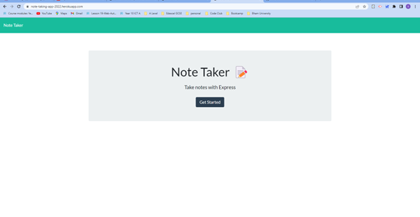
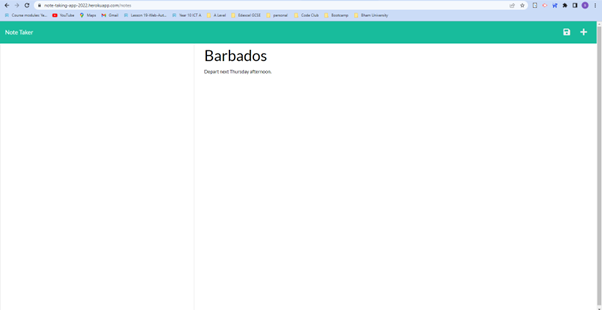

# take-notes

A note taker application

## Table of Contents

- [Description](#description)
- [Installation](#installation)
- [Usage](#usage)
- [License](#license)
- [Contributing](#contributing)
- [Tests](#tests)
- [Questions](#questions)
- [Deployed application](#deployment)

## Description

Allows the user to add notes and delete notes.

## Installation

Type in npm install to install express.

## Usage

Run npm start or node server.js

The following image shows the steps to use the 'take-notes application':

## License

MIT License

Copyright (c) 2022 smiller-2019

Permission is hereby granted, free of charge, to any person obtaining a copy
of this software and associated documentation files (the "Software"), to deal in the Software without restriction, including without limitation the rights to use, copy, modify, merge, publish, distribute, sublicense, and/or sell copies of the Software, and to permit persons to whom the Software is
furnished to do so, subject to the following conditions:

The above copyright notice and this permission notice shall be included in all copies or substantial portions of the Software.

THE SOFTWARE IS PROVIDED "AS IS", WITHOUT WARRANTY OF ANY KIND, EXPRESS OR
IMPLIED, INCLUDING BUT NOT LIMITED TO THE WARRANTIES OF MERCHANTABILITY,
FITNESS FOR A PARTICULAR PURPOSE AND NONINFRINGEMENT. IN NO EVENT SHALL THE
AUTHORS OR COPYRIGHT HOLDERS BE LIABLE FOR ANY CLAIM, DAMAGES OR OTHER
LIABILITY, WHETHER IN AN ACTION OF CONTRACT, TORT OR OTHERWISE, ARISING FROM, OUT OF OR IN CONNECTION WITH THE SOFTWARE OR THE USE OR OTHER DEALINGS IN THE SOFTWARE.

## Contributing

GitHub Profile of Contributors: Please fork the repo and create a pull request as follows: 1. Fork the Project 2. Create your Feature Branch. 3. Commit your Changes. 4. Push to the Branch. 5. Open a Pull Request
Open a Github issue with the tag 'improvements'

## Tests

To test on a server such as express, run npm start then using insomnia type in http://localhost:3001/api/notes to GET all notes. To select a specific note type in http://localhost:3001/api/notes/<note id> on a GET. To add a note type in http://localhost:3001/api/notes on a POST. To delete a note type in http://localhost:3001/api/notes<note id> on a DELETE.

To test the frontend locally type in localhost:3001 in the browser after running npm start or node server.js.

To test on Heroku follow the installation documentation for Heroku.:

[Full-Stack Blog on installing the Heroku CLI](https://coding-boot-camp.github.io/full-stack/heroku/how-to-install-the-heroku-cli).

[Heroku documentation on getting started with Node.js](https://devcenter.heroku.com/articles/getting-started-with-nodejs?singlepage=true)

[Heroku documentation on creating a Heroku remote](https://devcenter.heroku.com/articles/git#creating-a-heroku-remote)

## Questions

If there are any questions then you can contact me via:

Email: sue@myapp.com

GitHub Profile: [smiller-2019](https://github.com/smiller-2019/)

GitHub Repository: [smiller-2019](https://github.com/smiller-2019/)

## Deployment

[Deployed application on Heroku](https://note-taking-app-2022.herokuapp.com/)
